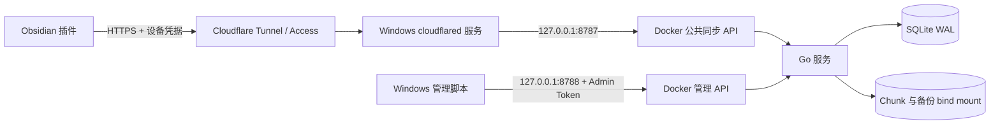

# Obsidian Sync Tunnel

[English](README.en.md) | 简体中文

一个面向个人自托管的 Obsidian 全 Vault 同步系统：Go + SQLite 服务运行在 Windows Docker Desktop 中，数据持久化到 Windows 宿主机；Cloudflare Tunnel 提供 HTTPS 入口；非官方 Obsidian 插件负责 Windows、macOS、Android 和 iOS 客户端同步。

当前版本：`1.0.0-rc.1`。这是候选版本，不应作为真实 Vault 的唯一副本，也不能替代独立备份。

> 本项目不会发布服务端二进制或公共容器镜像。GitHub Release/BRAT 只分发插件；服务端从同一 Git Tag 的源码在本机通过 Dockerfile 构建。

## 功能

- 单用户、多逻辑 Vault、多设备；
- 同步 Markdown、Canvas、图片、附件以及 `.obsidian` 中的设置、主题、CSS 和其他插件；
- Notes、Recommended、Full、Custom 四种同步范围，默认使用 Recommended；
- 首次同步预览，以及安全合并、远端优先、本地优先三种初始化方式；
- 文件事件增量同步、周期全量扫描和完整性重新哈希；
- 4 MiB 分块、缺块查询、断点续传和 SHA-256 完整性校验；
- 持久化 outbox/inbox，支持断网、Obsidian 退出和服务重启后恢复；
- revision 乐观锁、幂等操作、冲突副本、原子重命名和批量删除；
- 文件历史、删除版本浏览和恢复；
- 每设备独立凭据、一次性配对码、scope、轮换和撤销；
- Vault 配额、限速、审计、doctor、设备 ACK 和两阶段 GC；
- SQLite + Chunk 在线一致性备份、校验和可回滚恢复；
- 中英文插件设置、活动记录、进度、暂停/取消、冲突中心和脱敏诊断。

## 同步范围

| 模式 | 同步内容 | 说明 |
|---|---|---|
| Notes | Vault 根目录中的笔记与附件 | 不同步 `.obsidian` |
| Recommended | Notes + 常用设置、主题、CSS 和插件程序 | 默认；不同步其他插件的 `data.json` |
| Full | 除 Sync Tunnel 自身目录外的完整 Vault | 可能复制其他插件 `data.json` 中的 API Key、Cookie 和本地路径 |
| Custom | 完整扫描 + 自定义排除 glob | 适合清楚了解目录结构的用户 |

Sync Tunnel 自身插件目录始终保持设备本地，其中的 `data.json`、凭据引用、队列、诊断和运行代码不会同步。

## 架构概览



完整设计见[架构文档](docs/ARCHITECTURE.md)，接口见[1.0 协议](docs/PROTOCOL_1.0.zh-CN.md)。

## 准备条件

服务器电脑：

- Windows 10/11；
- Docker Desktop，使用 Linux containers；
- Git 与 PowerShell；
- 已安装 `cloudflared`，并允许作为 Windows 服务运行；
- 一个已接入 Cloudflare 的域名，用于稳定 Public Hostname。临时测试可使用 Quick Tunnel，但 URL 会变化；
- BitLocker 或等效磁盘加密，以及另一台设备上的加密备份位置。

客户端：

- Obsidian `1.11.4` 或更高版本；
- 已启用社区插件；
- BRAT，用于从 GitHub Release 安装本插件。

## 快速部署

### 1. 获取与插件相同版本的服务源码

```powershell
git clone --branch 1.0.0-rc.1 --depth 1 https://github.com/qoxop/obsidian-sync-tunnel.git
Set-Location .\obsidian-sync-tunnel
```

不要从 `main` 随意组合插件和服务端；两者应来自同一个不可移动 Tag。

### 2. 初始化并启动 Docker 服务

```powershell
Set-ExecutionPolicy -Scope Process Bypass -Force
.\scripts\docker-init.ps1
.\scripts\docker-up.ps1
```

默认创建：

```text
runtime-data/             SQLite、WAL、Chunk 和 JSONL 日志
runtime-backups/          在线一致性备份
secrets/admin-token.txt   仅供本机管理使用的 Admin Token
.env                      版本、端口、限制和宿主机映射路径
```

验证：

```powershell
docker compose ps
Invoke-RestMethod http://127.0.0.1:8787/healthz
Invoke-RestMethod http://127.0.0.1:8788/healthz
```

两个宿主机端口都只绑定 `127.0.0.1`。不要把 `host_ip` 改成 `0.0.0.0`。

### 3. 配置 Cloudflare Tunnel

在 Cloudflare Zero Trust 中：

1. 创建或选择一个 Named Tunnel；
2. 在 Windows 上安装 connector，或运行管理员 PowerShell：

   ```powershell
   .\scripts\install-cloudflare-tunnel.ps1
   ```

3. 为 Tunnel 添加 Public Hostname，例如 `sync.example.com`；
4. Service/Origin 填写 `HTTP` + `127.0.0.1:8787`；
5. 确认 `https://sync.example.com/healthz` 返回 `status: ok`；
6. 推荐为该 Hostname 配置 Cloudflare Access Self-hosted Application 和 Service Token。

绝不能为 `8788` 创建 Public Hostname。Cloudflare Access 只是一层边缘保护，不能取代 Sync Tunnel 的设备凭据。

### 4. 创建逻辑 Vault 和配对码

```powershell
.\scripts\admin.ps1 -CreateVault -VaultId personal-notes -DisplayName 'Personal notes'
.\scripts\admin.ps1 -CreatePairing -VaultId personal-notes -TTLSeconds 600
```

`VaultId` 是服务端同步空间标识，不是本地文件夹路径。需要同步到一起的设备使用同一个 Vault ID，但每台设备都必须生成新的、一次性的配对码。

Admin Token 只供 `admin.ps1` 在本机使用，永远不要填入 Obsidian。

### 5. 通过 BRAT 安装插件

在每台 Obsidian 设备中：

1. 安装并启用 BRAT；
2. 打开 `Settings → BRAT → Add Beta plugin`；
3. 输入 `https://github.com/qoxop/obsidian-sync-tunnel`；
4. 选择可用的 `1.0.0-rc.1` prerelease；
5. 在“社区插件”中启用 **Sync Tunnel**。

也可以从 GitHub Release 下载 `main.js`、`manifest.json` 和 `styles.css`，放入 `<Vault>/.obsidian/plugins/sync-tunnel/` 后重载 Obsidian。

### 6. 配置插件并完成首次同步

打开 `Settings → Sync Tunnel → Setup wizard`，填写：

- Server URL：Cloudflare HTTPS 地址，例如 `https://sync.example.com`；
- Vault ID：刚创建的逻辑 Vault ID；
- Device name：便于识别的设备名；
- Pairing code：本机管理脚本刚生成的一次性配对码；
- Sync profile：首次使用保持 **Recommended**。

如果启用了 Cloudflare Access Service Token，再在插件设置中填写 Client ID 和 Client Secret。配对后：

1. 点击 **Test connection**；
2. 点击 **First sync preview**；
3. 审查本地与远端数量；首次使用选择 **安全合并（推荐）**；
4. 点击 **Sync now**，等待完成；
5. 再点击一次 **Sync now**，上传、下载、删除和冲突计数应全部为 0；
6. 确认无误后再开启 Automatic sync 和 Sync on startup。

接入第二台设备时，保留相同 Server URL 和 Vault ID，在服务器电脑上为它生成一个新的配对码，然后重复安装、配对、预览和两次同步。

## 日常运维

```powershell
.\scripts\docker-up.ps1
.\scripts\docker-down.ps1
.\scripts\docker-logs.ps1 -Follow

.\scripts\admin.ps1 -ListVaults
.\scripts\admin.ps1 -ListDevices -VaultId personal-notes
.\scripts\admin.ps1 -Stats
.\scripts\admin.ps1 -Doctor

.\scripts\docker-backup.ps1 -KeepLast 7
.\scripts\docker-verify-backup.ps1 -BackupDirectory '<备份目录>'
```

撤销丢失设备：

```powershell
.\scripts\admin.ps1 -SetDeviceStatus `
  -VaultId personal-notes -DeviceId '<device-id>' -Status revoked
```

恢复备份是有风险的写操作，执行前阅读[Docker 部署与运维](docs/DOCKER_DEPLOYMENT.zh-CN.md)。不要在服务运行时直接复制 live `sync.db`。

## 升级

1. 先运行在线备份并把已校验备份复制到异机加密存储；
2. 阅读目标 Release 的 breaking changes；
3. 检出新的不可移动 Tag；
4. 保留现有 `.env`、数据、备份和 secrets 路径；
5. 运行 `.\scripts\docker-up.ps1` 从新 Tag 本机构建并替换容器；
6. 通过 BRAT 更新每台设备的插件；
7. 检查 health、doctor、插件连接测试和双次同步收敛。

1.0 正式版发布前不承诺兼容任何旧协议或旧插件数据 schema；候选版本的升级要求以 Release 说明为准。镜像回滚不等于数据库回滚，数据库发生不兼容变化时必须恢复同一时点的完整备份。

## 安全与数据责任

- 1.0 不是端到端加密系统；服务器磁盘和备份可以读取明文内容、路径与历史；
- 使用 BitLocker、严格 Windows ACL 和异机加密备份；
- 不要把 Admin Token、设备凭据、配对码或 Cloudflare Access Secret 写入 Git、笔记、命令历史或截图；
- Full 模式可能同步其他插件保存的秘密，除非明确了解风险，否则使用 Recommended；
- 历史版本、tombstone、同机备份和 Cloudflare 都不是灾难恢复备份；
- 真实 Vault 在验证完成前始终保留独立副本。

安全边界和剩余风险见[威胁模型](docs/THREAT_MODEL.zh-CN.md)，漏洞报告方式见[SECURITY.md](SECURITY.md)。

## 开发与测试

```powershell
go test ./...
go vet ./...
.\scripts\smoke-selftest.ps1

Set-Location .\plugin
npm ci
npm run typecheck
npm test
npm run build
```

详细覆盖、规模测试和 CI 门禁见[测试文档](docs/TESTING.md)。

## 文档

- [完整架构设计](docs/ARCHITECTURE.md)
- [1.0 HTTP 协议](docs/PROTOCOL_1.0.zh-CN.md)
- [Docker Desktop 部署与运维](docs/DOCKER_DEPLOYMENT.zh-CN.md)
- [测试与质量门禁](docs/TESTING.md)
- [1.0 人工验收清单](docs/MANUAL_ACCEPTANCE_1.0.zh-CN.md)
- [GitHub 与 BRAT 非官方插件分发](docs/GITHUB_RELEASE.zh-CN.md)
- [1.0 发布清单](docs/RELEASE_CHECKLIST_1.0.zh-CN.md)
- [威胁模型](docs/THREAT_MODEL.zh-CN.md)

## License

[MIT](LICENSE)
