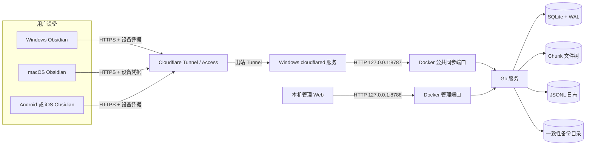
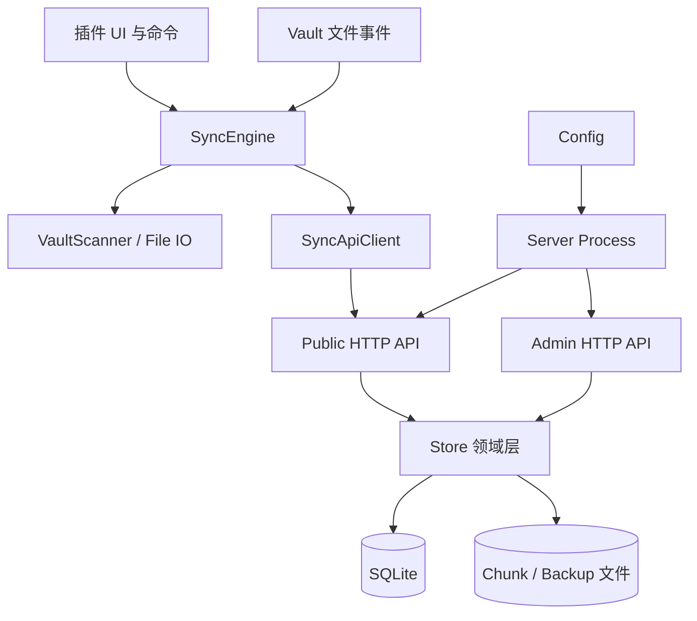
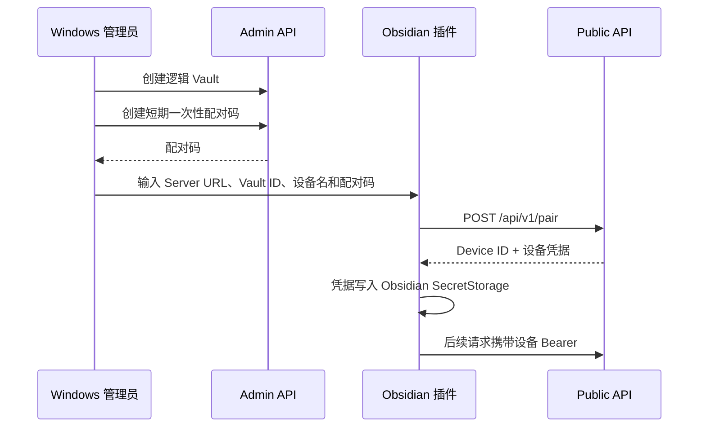
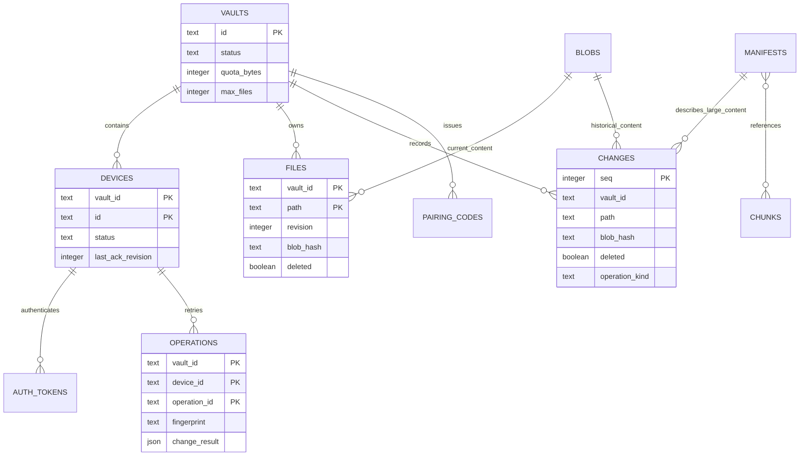
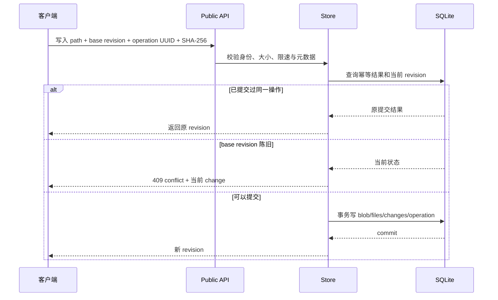
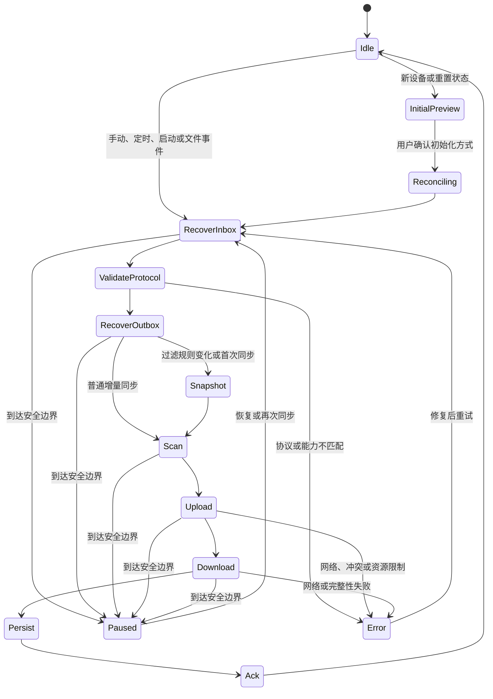
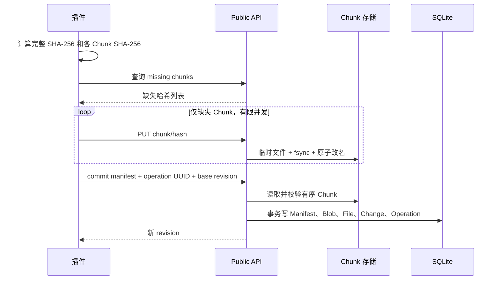
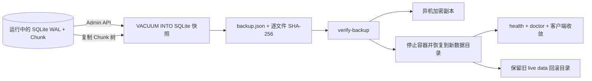
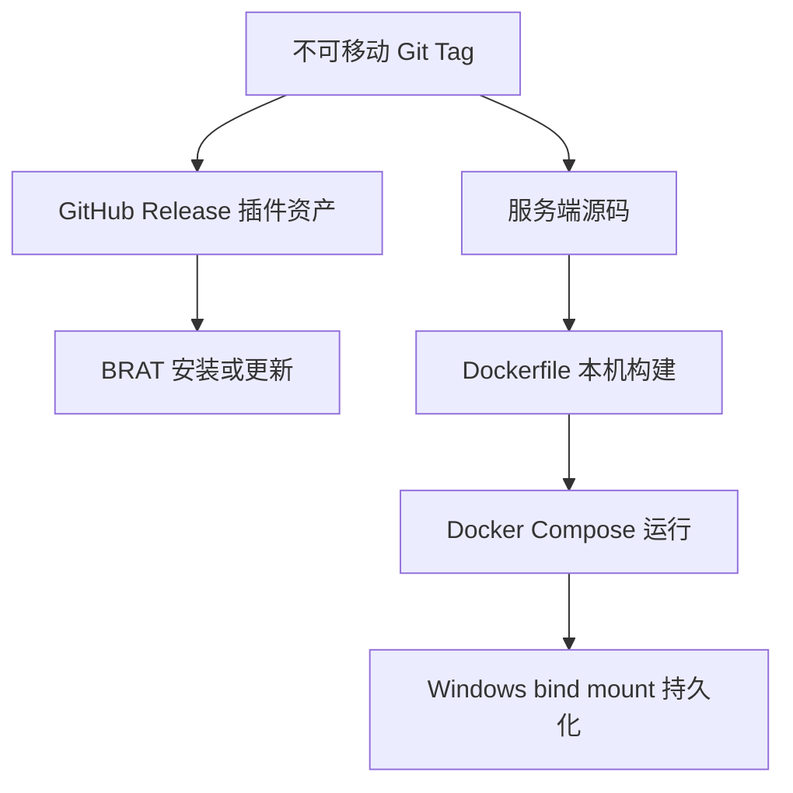

# Sync Tunnel 1.0 架构设计

本文描述当前代码的真实架构、关键不变量和扩展边界。HTTP 协议细节见[协议文档](PROTOCOL_1.0.zh-CN.md)，部署操作见[Docker 部署文档](DOCKER_DEPLOYMENT.zh-CN.md)。

## 1. 目标、边界与关键决策

Sync Tunnel 是面向个人自托管场景的 Obsidian 全 Vault 同步系统。一个可信管理员可以创建多个逻辑 Vault，每个逻辑 Vault 可以接入多台 Windows、macOS、Android 或 iOS 设备。

核心目标：

- 同步普通笔记、图片、附件、Canvas、Obsidian 配置、主题、CSS 与其他插件文件；
- 在网络中断、客户端退出或服务重启后安全续传；
- 不静默覆盖并发修改，冲突时保留双方内容；
- 以单机 Go 进程和 SQLite 完成部署，降低个人运维成本；
- 公共同步入口与本地管理入口彻底分离；
- 默认提供比“复制整个 `.obsidian`”更安全的同步范围。

明确边界：

- 单管理员而非多租户协作平台；
- 1.0 服务端保存明文路径、正文、历史和 Chunk，端到端加密不在当前版本；
- 不提供 Web 编辑、服务端全文搜索、字符级自动合并或文件共享链接；
- 不支持 0.x 协议或旧客户端状态继续运行；
- 不保证与其他实时双向同步工具同时操作同一 Vault 时的正确性。

关键架构决策：

| 决策 | 选择 | 原因 |
|---|---|---|
| 服务端 | 单 Go 进程、公共和管理双 HTTP Server | 部署简单，同时隔离公网与管理面 |
| 元数据 | SQLite WAL | 单机事务、备份和诊断成本低 |
| 内容标识 | SHA-256 内容寻址 | 去重、完整性校验和断点续传可共享同一标识 |
| 一致性 | 单调 revision + base revision 乐观锁 | 防止陈旧客户端静默覆盖 |
| 重试 | 每设备 operation UUID 幂等 | 网络超时后可查询并接受原提交结果 |
| 大文件 | 固定 4 MiB Chunk + Manifest | 只重传缺失分块 |
| 客户端恢复 | 持久化 outbox、inbox、游标与文件状态 | Obsidian 或网络中断后继续工作 |
| 部署 | Windows Docker Desktop + bind mount | 容器可替换，数据仍由宿主机控制 |
| 外网入口 | Windows `cloudflared` 到 `127.0.0.1:8787` | 不开放家庭网络入站端口 |
| 发布 | GitHub Release/BRAT 只分发插件 | 服务端从同名 Tag 在本机用 Dockerfile 构建 |

## 2. 系统上下文与运行拓扑

逻辑 Vault ID 是服务端同步空间的名字，不等于 Obsidian 本地目录名。不同设备只要配对到同一个逻辑 Vault，就会收敛到同一远端状态。



安全边界：

- Compose 只把 `8787` 和 `8788` 发布到宿主机 `127.0.0.1`；
- Cloudflare Public Hostname 只允许指向 `http://127.0.0.1:8787`；
- `8788` 永远不进入 Tunnel、Obsidian 或普通笔记，应用层同时校验回环 Host 和同源 Origin；
- 容器内部监听 `0.0.0.0` 仅为 Docker NAT，宿主机仍由 Compose 限制为回环地址；
- SQLite、Chunk、日志与备份通过 Windows bind mount 持久化，删除容器不会删除数据。

## 3. 仓库与组件边界

```text
cmd/obsidian-sync-server/  服务端 CLI 与进程生命周期
internal/config/           配置加载和安全校验
internal/httpapi/          公共 API、管理 API、鉴权、限速和错误映射
internal/store/            领域模型、SQLite、Chunk、历史、GC 和备份
plugin/src/                Obsidian 插件、同步状态机和产品界面
plugin/tests/              插件单元与状态机测试
admin-web/src/             本机管理 Web 页面与 Admin API 客户端
scripts/                   一键安装、灾难恢复、构建、发布和测试工具
docs/                      长期维护的架构、协议、运维和发布文档
```



依赖约束：

- `internal/store` 不依赖 HTTP，可直接进行单元和状态机测试；
- `internal/httpapi` 负责协议适配，不在 Handler 中散落 SQL；
- 插件同步状态机通过 `SyncApiClient` 和 Obsidian `DataAdapter` 访问外部世界；
- UI 负责收集确认和展示状态，不决定 revision、冲突或删除语义；
- 管理 Web 只调用 Admin API，不直接访问 SQLite；灾难恢复脚本只在停服后替换完整数据集。

## 4. 服务端进程架构

`obsidian-sync-server` 是一个多命令二进制：

| 命令 | 作用 |
|---|---|
| `serve` | 打开 SQLite，启动公共与管理 HTTP Server，处理优雅退出 |
| `token` | 生成至少 32 字节的高熵 Admin Token |
| `healthcheck` | 供 Docker HEALTHCHECK 检查公共端点 |
| `backup` | 创建 SQLite 与 Chunk 的一致性备份 |
| `verify-backup` | 校验备份 manifest、大小与 SHA-256 |
| `restore-backup` | 把已验证备份恢复到空目录 |
| `doctor` | 检查 SQLite 完整性、Chunk 缺失/损坏和孤儿文件 |
| `version` | 输出构建时注入的版本 |

`serve` 启动两个独立 `http.Server`：公共端默认 `127.0.0.1:8787`，管理端默认 `127.0.0.1:8788`。任一 Server 异常退出都会触发进程关闭；收到 `SIGTERM` 或中断信号后，两者共享 15 秒优雅关闭窗口。

配置优先由安全默认值提供，可选 JSON 配置文件，再由显式 CLI 参数覆盖。除非显式打开容器场景开关，配置校验会拒绝非回环监听。管理端默认使用 `none` 模式并依赖回环端口边界；多人共用主机可启用 `token` 模式，Token 仅从只读文件解析。

## 5. 身份、权限与信任模型

系统有两类身份，不能互换：

1. **管理员入口**：仅本机可访问的管理 Web；可选 Token 模式用于多人共用主机。
2. **设备身份**：一次性配对成功后由服务端分配 Device ID，并返回该设备自己的 Bearer 凭据。



设备凭据具有 scope，默认包括 `sync:read`、`sync:write`、`history:read` 和 `restore:write`。服务端只保存 Token 哈希和短前缀；轮换后旧 Token 立即撤销。设备可标记为 `retired` 或 `revoked`，Vault 可标记为 `suspended`。

Cloudflare Access Service Token 是可选的边缘第二层认证，不代替设备凭据。插件只把 Access Secret 和设备凭据放入 SecretStorage；普通插件设置 `data.json` 只保留 SecretStorage 引用名。

## 6. 服务端数据模型

当前数据库 schema 为 `7`。revision 使用 `changes.seq` 的全局单调序列；客户端只在自己的逻辑 Vault 内解释游标。



表的职责：

- `files` 保存每个 Vault/路径的当前指针，包括 tombstone；
- `changes` 追加保存每次成功变更，是增量同步和历史恢复的依据；
- `blobs` 保存按 SHA-256 寻址的完整内容；
- `chunks` 保存磁盘 Chunk 元数据，实际字节位于 `/data/blobs/chunks/<前缀>/<hash>`；
- `manifests` 保存完整内容哈希、总长度和有序 Chunk 列表；
- `operations` 保存每设备幂等请求的 fingerprint 与原结果；
- `devices.last_ack_revision` 是安全回收历史时的设备水位线；
- `gc_plans`、`backup_runs` 和 `audit_events` 记录运维动作。

SQLite 打开后启用外键、WAL 和 busy timeout。所有影响当前文件与变更日志的写操作在事务内完成。

## 7. 文件版本与一致性不变量

每次写入、删除、重命名或恢复都遵守以下不变量：

1. 路径先规范化为 `/` 分隔的相对 Vault 路径；绝对路径、空路径、`.`、`..` 和路径穿越被拒绝。
2. 请求携带当前已知 `base revision`。服务端当前 revision 不匹配时返回冲突，不执行覆盖。
3. 成功变更同时更新 `files` 并追加 `changes`，二者在同一事务提交。
4. 删除写入 tombstone，不立即删除历史内容。
5. 内容哈希必须与上传字节一致；客户端下载后也再次校验大小与 SHA-256。
6. 相同设备、相同 operation UUID 和相同 fingerprint 的重试返回原结果，不生成第二个 revision。
7. 相同 operation UUID 若被用于不同请求，服务端拒绝，避免误接受重放。



## 8. 插件持久化状态

插件 schema 当前为 `9`。核心状态包括：

| 状态 | 用途 |
|---|---|
| `cursor` | 已处理的服务端 revision |
| `files` | 已确认的每路径哈希、revision、大小和删除状态 |
| `scanCache` | 以大小和 mtime 避免无意义重复哈希 |
| `pendingPaths` / `pendingRenames` | Obsidian 文件事件形成的增量工作集 |
| `outbox` | 已分配 operation UUID、尚未确认完成的上传/删除/重命名 |
| `inbox` | 下载临时文件、备份文件和替换阶段 |
| `filterFingerprint` | 同步范围变化检测；变化后强制稳定快照对账 |
| `lastAcknowledgedRevision` | 已向服务端确认的本地持久化水位线 |
| `activities` / `conflicts` | 最近活动与用户可见冲突记录 |

Sync Tunnel 自己的插件目录始终排除同步，因此其中的 `data.json`、SecretStorage 引用、临时下载、诊断和运行代码不会被另一台设备覆盖。

## 9. 同步状态机



一次正常同步的执行顺序：

1. 恢复未完成 inbox，保证上次下载不会留下半替换状态；
2. 获取 `server-info`，严格检查协议版本和必需 capability；
3. 查询并恢复 outbox 中幂等操作的结果，或继续未上传的 Chunk；
4. 首次接入、范围变化或需要全量扫描时，读取固定 revision 快照；
5. 处理本地重命名队列；
6. 使用事件工作集增量扫描；每小时强制全量扫描，每 24 小时强制重新哈希完整性扫描；
7. 上传本地新增、修改和删除；
8. 从当前 cursor 分页拉取远端变更并应用；
9. 先持久化客户端状态，再向服务端 ACK cursor，再持久化 ACK 状态。

暂停和取消只在安全检查点生效。已记录的 outbox/inbox 不会丢弃，下一次同步从持久化边界恢复。

## 10. 首次同步与同步范围

新设备在任何写入前必须生成本地/远端预览，并由用户选择：

- **安全合并（推荐）**：下载远端，上传仅本地文件；同路径差异保留本地冲突副本后采用远端版本；
- **以远端为主**：远端成为主状态，仅本地内容先改名为冲突副本，不静默删除；
- **以本地为主**：本地覆盖或删除远端，只适合明确知道本地是权威副本的场景。

同步配置：

| 配置 | Vault 根目录 | `.obsidian` 范围 | 适用场景 |
|---|---|---|---|
| Notes | 同步 | 不同步 | 只同步内容 |
| Recommended | 同步 | 常用设置、主题、CSS、插件 `main.js`/`manifest.json`/`styles.css` | 默认，兼顾体验和秘密隔离 |
| Full | 同步 | 除 Sync Tunnel 自身外全部同步 | 用户明确接受复制其他插件 `data.json` 中秘密 |
| Custom | 同步 | 由排除 glob 决定 | 高级用户自定义 |

默认排除 `.git/**`、`.trash/**`、`.DS_Store` 和 `Thumbs.db`。过滤规则的规范化结果会生成 fingerprint；任何改变都会触发新快照，防止旧跟踪状态误传播删除。

## 11. 大文件、断点续传与原子落盘

文件上限默认 64 MiB，Chunk 固定为 4 MiB。插件先计算完整文件哈希与 Chunk 哈希，批量查询服务端缺块，仅上传缺失 Chunk，最后提交 Manifest。服务端重新组装并验证完整内容哈希后才创建 revision。



桌面端使用 Node 流计算哈希，并可把下载 Chunk 流式写入同目录临时文件；移动端受 Obsidian API 限制，使用内存读写并额外应用可配置的移动端文件上限。下载完成后按“临时文件 -> 校验 -> 备份旧文件 -> 原子替换 -> 清理备份”的阶段执行。应用 `.obsidian` 中需要重载的文件后，插件明确提示重启 Obsidian。

## 12. 冲突、重命名、删除与恢复

- 陈旧写入不会覆盖远端；插件把本地字节保存为带时间和设备标识的冲突副本，再应用远端当前版本；
- 冲突中心记录双方 revision、哈希与路径；小于 1 MiB 且为 UTF-8 的文本可进行预览；
- 重命名是一个原子服务端操作：创建目标 revision 并为源路径写 tombstone；
- 批量删除最多 100 个路径，在一个事务中全部成功或全部失败；
- 历史恢复读取指定旧 revision 的内容，并以新的 `restore` revision 写回，不改写历史。

这套机制保证“可追溯和不静默丢失”，但不提供自动语义合并。冲突是否合并仍由用户决定。

## 13. ACK、GC 与历史保留

设备只有在本地状态成功保存后才 ACK 当前 cursor。GC 计划综合：

- 所有 active 设备的最小 ACK 水位线；
- `retention_days` 最短保留时间；
- 每个路径 `keep_versions` 最少保留版本；
- 当前文件仍引用的 Blob/Manifest/Chunk；
- 尚未安全越过水位线的 tombstone 和历史。

GC 必须分两阶段执行：先生成包含精确删除对象与估算字节数的不可变计划，管理员审查后再携带 plan ID 和 plan hash 执行。数据状态变化或哈希不一致时拒绝执行，避免“边看边删”。

## 14. 备份、恢复与诊断



管理 Web 通过 Admin API 创建和校验在线一致性备份；`docker-restore.ps1` 再次校验后停止容器，将旧数据移动到可恢复目录，再启动新数据并等待健康检查。备份不包含管理凭据，但包含明文 Vault 内容，必须复制到另一台设备上的加密存储。

`doctor` 检查 SQLite、Chunk 缺失、Chunk 损坏和孤儿文件。`stats` 提供 Vault、设备、文件、历史、Blob 和 Chunk 计数。日志使用 JSONL，记录 request ID、路由、状态和耗时，不记录 Token、正文或完整路径；管理 Web 可读取最近的结构化日志。

## 15. 限制、配额与故障语义

服务端在写入前检查：

- 单文件大小；
- Vault 逻辑字节配额和文件数上限；
- 服务器磁盘最低可用空间；
- 每设备每分钟请求数与上传字节数；
- 请求体大小、分页大小、Chunk 查询数量和批量删除数量。

可重试故障包括临时网络错误、`429` 和部分 `5xx`；客户端使用有限次数退避。认证、协议不兼容、路径非法、资源上限和冲突需要用户操作或新状态对账，不进行无限重试。所有 API 错误使用稳定错误码，敏感细节只保留在脱敏日志中。

## 16. 部署与发布架构



项目不发布服务端二进制或公共容器镜像。插件 Release 与服务端源码必须来自同一个不可移动 Tag；CI 验证 Go、插件和 Dockerfile，但只把 `main.js`、`manifest.json`、`styles.css`、校验和和插件 SBOM 发布到 GitHub Release。

## 17. 测试架构与变更原则

自动测试分层：

- Store 单元测试：revision、冲突、幂等、Chunk、重命名、批量删除、身份、历史、配额、GC、备份和 doctor；
- Store 状态机测试：多个设备的确定性操作序列与模型状态对照；
- HTTP 接口测试：真实 Handler、鉴权、scope、撤销、错误码和管理生命周期；
- 插件测试：数据 schema、路径、过滤、首次同步、API 重试、分块和同步状态机；
- 冒烟测试：启动临时服务，经过公共与管理 API 完成一轮核心生命周期；
- CI：Windows 主测试、Linux race detector、Docker 镜像构建、CodeQL。

需要人工验证的内容集中在真机文件系统和产品交互：首次同步确认、跨平台大小写/Unicode、Obsidian 重启、断网与进程中断、移动端内存限制、Cloudflare Access、备份恢复以及真实插件生态。

架构变更遵循以下原则：

1. 先写清协议和持久化不变量，再修改服务端与插件；
2. 1.0 发布前不为 pre-1.0 增加兼容分支；
3. 新功能必须能在 Store、HTTP 或同步状态机边界独立测试；
4. 不让 UI、脚本或 HTTP Handler 绕过领域事务；
5. 任何删除、GC 或恢复能力必须保留预览、校验或回滚路径；
6. 新的外部依赖和联网行为必须更新 README、威胁模型与发布说明。

## 18. 当前已知技术限制

- 服务端提交 Manifest 时会在内存中组装完整文件，因此默认 64 MiB 上限同时是内存保护边界；
- 移动端没有稳定的通用流式 Vault API，大文件上限通常应低于服务端上限；
- 文件事件只是优化信号，最终正确性仍依赖周期性全量扫描和每日重新哈希；
- 跨平台大小写与 Unicode 规范化冲突会被提前拒绝，不能自动重命名；
- 配置文件与插件程序同步后可能需要重启 Obsidian 才能完全生效；
- 自托管单机仍存在主机故障域，必须依赖异机加密备份解决灾难恢复。
