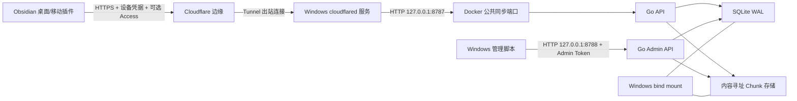

# Sync Tunnel 1.0 架构与代码边界

## 产品模型

1.0 面向一个可信管理员，支持多个逻辑 Vault 和多台设备。服务不是多租户协作平台，也不是公开注册网盘。逻辑 Vault ID 是服务端同步空间标识，不等同于 Obsidian 本地目录名；两台设备只要配置同一 Vault ID，就会同步到同一远端空间。

pre-1.0 不属于兼容面。服务和插件只维护一套协议、一套鉴权模型和一套客户端数据 schema；旧客户端必须升级并重新配对。

## 运行拓扑

公共 API 和管理 API 使用不同端口。Cloudflare 只允许指向 `8787`；`8788` 仅供本机管理员操作。容器内部为 Docker NAT 显式监听 `0.0.0.0`，Compose 在宿主机侧仍只发布到 `127.0.0.1`。

## 代码分层

| 层 | 目录 | 责任 |
|---|---|---|
| 入口与进程 | `cmd/obsidian-sync-server` | CLI、配置、日志、双 HTTP Server、优雅关闭、Windows Service |
| 公共/管理 API | `internal/httpapi` | 路由、鉴权、限速、请求限制、错误映射、脱敏日志 |
| 领域与持久化 | `internal/store` | Vault/设备/凭据、文件 revision、Chunk/Manifest、历史、ACK、GC、备份、doctor |
| 配置 | `internal/config` | 安全默认值、回环监听验证、Admin Token 解析、资源限制 |
| 插件 API | `plugin/src/api-client.ts` | 最终 `/api/v1` 协议、重试、设备 Bearer、Cloudflare Access 头 |
| 插件状态机 | `plugin/src/sync-engine.ts` | 快照对账、扫描、outbox/inbox、分块、冲突、ACK、进度和暂停边界 |
| Vault 边界 | `vault-scanner.ts` / `file-io.ts` | 同步配置、排除、自身保护、桌面流式 I/O、移动内存限制 |
| 产品界面 | `main.ts` / `settings.ts` / `management-modals.ts` | 配置向导、Activity、冲突中心、历史恢复、诊断、重启提示 |

HTTP 层不拼接 SQL，不决定同步冲突语义；Store 不依赖 HTTP；同步状态机依赖抽象的 API Client 和 Obsidian DataAdapter，因此可独立测试。

## 数据模型与一致性

- `vaults`：逻辑同步空间、显示名、状态、配额和文件数限制；
- `devices`：服务端分配不可变 ID、平台、客户端版本、状态和 ACK revision；
- `auth_tokens`：只保存凭据哈希、前缀、scope、轮换/撤销时间；
- `pairing_codes`：哈希存储、短 TTL、一次性消费；
- `files`：每个 Vault/路径的当前指针；
- `changes`：只增 revision、tombstone、操作类型和恢复来源；
- `blobs`：小文件/组装后内容，SHA-256 寻址；
- `chunks` + `manifests`：大文件分块、缺块查询和续传；
- `operations`：按 Vault/设备/UUID 保存幂等结果；
- `gc_plans`：待执行计划、规范哈希和状态；
- `backup_runs`、`audit_events`：运维结果与安全审计。

写入以 `base revision` 做乐观并发控制。相同内容或相同幂等操作重试不会产生重复 revision；陈旧写入返回当前状态，由插件保留冲突副本。下载先进入同目录临时文件，校验大小和 SHA-256 后再原子替换；进程中断时 inbox/outbox 能继续恢复。

## 同步范围

- Notes：笔记、Canvas/Bases 和选定附件；
- Recommended：Notes + 常用设置、主题、CSS 和插件程序，但排除其他插件 `data.json`；
- Full：除 Sync Tunnel 自身目录和设备本地文件外同步整个 Vault；
- Custom：类别和 glob 自定义，规则改变时重新做稳定快照对账。

Full 可能复制其他插件 `data.json` 中的 API Key、Cookie 和本地路径。它必须由用户主动选择。Sync Tunnel 自身 `data.json`、临时下载、备份副本和诊断报告永不参与同步。

## 恢复、GC 与备份

历史恢复会创建新的 revision，不改写旧记录。设备成功持久化本地状态后提交 ACK；GC 只考虑所有 active 设备都确认过的水位线，同时受保留天数和版本数约束。执行 GC 前必须先生成不可变计划，再携带计划哈希执行。

在线备份使用 SQLite `VACUUM INTO` 生成一致快照，同时复制 Chunk 树并生成逐文件 SHA-256 manifest。恢复前必须验证 manifest；脚本保留原数据为 rollback 目录。历史、tombstone 和同机备份都不能替代异机加密备份。

## 非目标

- 1.0 不做 E2EE、多人共享、Web 编辑、服务端内容搜索或自动字符级合并；
- 不支持 0.x 协议、全局同步 Token 或旧 `data.json` 状态续跑；
- 不承诺其他实时双向同步器与本插件同时作用于同一 Vault；
- 不把 Cloudflare Tunnel 或 Access 当作数据备份、设备身份或端到端加密。
