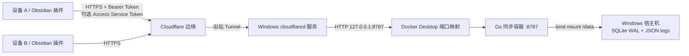

# Obsidian Sync Tunnel 完整开发方案

## 1. 目标与边界

### 目标

构建一套个人自托管的 Obsidian 双向同步系统：

- 同步 Vault 内全部普通文件类型，不区分 Markdown、图片、音视频、PDF 或其他二进制文件；
- 同步 `.obsidian` 下的主题、CSS、其他插件及插件配置；
- Go 服务运行在 Windows Docker Desktop 的 Linux 容器中，SQLite 通过 bind mount 持久化到 Windows 宿主机；
- 容器端口只映射到 Windows 回环地址；
- SQLite 保存文件内容、当前状态和只增变更日志；
- Cloudflare Tunnel 只建立由本机向外的连接，不开放家庭路由器端口；
- Obsidian 插件支持桌面端和移动端；
- 多设备同时修改同一路径时保留冲突副本，不静默丢数据；
- 提供可重复的构建、安装、卸载、备份和本地冒烟测试脚本。

### 首个版本明确不做

- 不把“同步”当作“备份”：服务端首版不提供版本恢复 UI；
- 不提供多用户、分享、权限分组或公开注册；
- 不提供端到端加密。传输由 HTTPS/Tunnel 保护，SQLite 中的内容是明文；
- 不承诺多个设备对同一文件进行字符级或块级合并；
- 不绕过 Cloudflare 套餐的单请求大小上限。首版按完整文件上传，服务端默认单文件上限 64 MiB，可配置；
- 不同步本插件自己的 `data.json`，因为其中包含设备 ID、游标、文件版本索引和 SecretStorage 引用，这些数据必须按设备隔离。

## 2. 总体架构



Go 服务在容器网络内监听 `0.0.0.0:8787`，但 Compose 使用 `host_ip: 127.0.0.1`，只把端口发布到 Windows 回环地址。`cloudflared` 主动连接 Cloudflare，并把 HTTPS 主机名转发到该本机端口。客户端仍必须通过同步服务自己的 256 位 Bearer Token；建议再叠加 Cloudflare Access Service Token。

## 3. 仓库结构

```text
cmd/obsidian-sync-server/    Go 服务入口
internal/config/             服务配置和密钥读取
internal/store/              SQLite 模型、事务和并发控制
internal/httpapi/            REST API、鉴权、请求限制
plugin/                      Obsidian TypeScript 插件
Dockerfile                   非 root、distroless 多阶段服务镜像
compose.yml                  回环端口、bind mount、secret 和健康检查
scripts/                     Docker、Windows 构建、备份、Tunnel 脚本
configs/                     可复制的配置样例
docs/                        架构、协议和操作手册
dist/                        本机构建产物，不提交 Git
runtime-data/                默认宿主机持久化目录，不提交 Git
secrets/                     默认宿主机 Token 目录，不提交 Git
```

## 4. 同步模型

### 4.1 统一二进制模型

服务端不解析文件内容。每个 Vault 路径都视为以下记录：

```text
(vault_id, path, revision, sha256, size, modified_at, deleted, device_id)
```

Markdown 和图片使用完全相同的协议，因此不会因为编码、换行符或扩展名而丢失信息。目录本身不单独同步；写入文件前由客户端按需创建父目录，空目录因此不在首版同步范围内。

### 4.2 版本与游标

- `revision` 是服务端全局递增的 SQLite `changes.seq`；
- 每个客户端保存自己最后看到的 `cursor`；
- 每个路径保存最后看到的 `revision` 和内容哈希；
- 删除写成 tombstone，而不是直接抹掉同步历史；
- 客户端按 `cursor` 分页拉取变更，成功落盘后再推进游标。

### 4.3 一次同步的顺序

1. 读取服务状态和单文件大小限制；
2. 递归扫描 Vault，并对每个文件计算 SHA-256；
3. 比较本地文件与该设备保存的文件索引；
4. 使用 `base_revision` 上传新增/修改或提交删除；
5. 如果服务端版本已变化，进入冲突流程；
6. 从客户端游标开始分页拉取远端变更；
7. 下载内容寻址的 Blob，并通过 Vault Adapter 写入；
8. 保存新文件索引和游标。

先推后拉可以确保本地未同步编辑先参与版本竞争，而不是被刚拉到的远端内容直接覆盖。

### 4.4 乐观并发控制

每次写入携带客户端最后看到的 `base_revision`：

- 与服务端当前版本相同：事务提交并生成新 revision；
- revision 不同但内容哈希已经相同：视为幂等成功，不重复写日志；
- revision 不同且内容不同：返回 HTTP 409 和服务端当前记录；
- 重试发生在服务已经提交、客户端却没收到响应的情况下，也会因哈希相同而安全收敛。

### 4.5 冲突规则

冲突以“保留两份”为第一原则：

- 本地修改与远端修改冲突：本地内容先写为 `name.conflict-设备-时间.ext`，原路径采用远端当前版本；
- 本地修改与远端删除冲突：本地内容写冲突副本，原路径按远端 tombstone 删除；
- 本地删除与远端修改冲突：恢复远端文件；
- 同内容、不同 revision：不产生冲突副本；
- 冲突副本在下一轮扫描中作为普通新文件上传。

这是确定性收敛规则，不是 Markdown 三方合并。后续可增加文本三方合并，但不能替代原始冲突副本。

### 4.6 同步范围与排除

默认同步 `.obsidian`，包括其他插件的 `main.js`、`manifest.json`、样式和 `data.json`。默认排除：

```text
.git/**
.trash/**
**/.DS_Store
**/Thumbs.db
```

另有一个不可取消的设备本地路径：

```text
<vault.configDir>/plugins/sync-tunnel/data.json
```

用户可以在设置中增加 glob。`.obsidian/workspace*.json` 默认仍同步；若设备布局差异很大，建议用户自行排除。

## 5. SQLite 数据设计

### `blobs`

以 SHA-256 为主键保存二进制内容。相同内容只存一次。

### `files`

`(vault_id, path)` 为联合主键，保存每个路径的当前 revision、Blob 哈希或删除标记。

### `changes`

只增日志，`seq INTEGER PRIMARY KEY AUTOINCREMENT` 同时充当 revision。客户端按 `(vault_id, seq)` 索引增量读取。

### 事务约束

Blob 写入、changes 追加和 files 当前指针更新在同一个事务中完成。SQLite 使用 WAL、外键约束和 busy timeout；服务首版限制为一个数据库写连接，换取明确的写入顺序。

### 数据保留

首版不自动清理 `changes` 和未引用 Blob，以免误删可用于恢复的数据。上线后需要观察数据库增长，再实现“保留 N 天 + 所有活跃设备水位线 + 显式备份后 GC”。

## 6. HTTP API v1

| 方法 | 路径 | 用途 |
|---|---|---|
| `GET` | `/healthz` | 无鉴权进程健康检查 |
| `GET` | `/api/v1/vaults/{vault}/status` | 最新 revision 和单文件上限 |
| `GET` | `/api/v1/vaults/{vault}/changes?after=&limit=` | 分页拉取变更 |
| `PUT` | `/api/v1/vaults/{vault}/file?path=` | 原始二进制文件上传 |
| `DELETE` | `/api/v1/vaults/{vault}/file?path=` | 写入删除 tombstone |
| `GET` | `/api/v1/vaults/{vault}/blobs/{sha256}` | 下载特定内容版本 |

所有 `/api/v1` 请求使用 `Authorization: Bearer <token>`。修改请求还使用：

```text
X-Device-ID
X-Base-Revision
X-Modified-At
X-Content-SHA256   # PUT 专用
```

Cloudflare Access 启用后，插件额外发送 `CF-Access-Client-Id` 与 `CF-Access-Client-Secret`。

## 7. 安全设计

- 非容器运行只允许监听 localhost/回环 IP；容器必须显式启用 `allow_non_loopback`，同时 Compose 强制把宿主机发布地址固定为 `127.0.0.1`；
- Token 由加密随机数生成器生成，最少 32 字节；
- Token 从 ACL 受限文件或 `OBSIDIAN_SYNC_TOKEN` 环境变量读取，不进入 Git；
- 服务端只保存 Token 的进程内 SHA-256，并用常量时间比较；
- 插件通过 Obsidian SecretStorage 引用 Token；插件 `data.json` 不保存明文 Token；
- 文件路径拒绝绝对路径、空段、`.`、`..`、NUL 和超长值；
- 上传大小由服务配置限制；
- Cloudflare 主机名使用 HTTPS；
- 日志不记录 Authorization、Access Secret 或文件内容；
- SQLite 是明文数据，应依靠 Windows 磁盘加密、bind mount 目录 ACL 和独立备份；
- 容器使用非 root 用户、只读根文件系统、capability drop、`no-new-privileges` 和 distroless 镜像；
- API Token 以只读 Compose secret 文件挂载，不写入镜像、Compose 环境变量或 Git；
- Tunnel Token、同步 Token、Access Service Token 必须分别管理和轮换。

## 8. Docker Desktop 运行方式

`scripts/docker-init.ps1` 创建 `.env`、宿主机数据目录和 Token 文件。Compose 将 Windows 数据目录映射为容器 `/data`，将 Token 文件以只读 secret 映射为 `/run/secrets/sync_api_token`。

默认结构：

```text
<repository>\
  .env
  runtime-data\
    sync.db
    sync.db-wal
    sync.db-shm
    server.jsonl
  secrets\
    api-token.txt
```

默认路径可以改为其他 Windows 磁盘。删除或重建容器不会删除 bind-mounted 数据。容器采用 `restart: unless-stopped`，Docker Desktop 启动后会恢复服务。

Cloudflare Tunnel 仍是独立的 `cloudflared` Windows 服务，Origin 为 `http://127.0.0.1:${OBSIDIAN_SYNC_PORT}`。Go 容器重建不需要重建 Tunnel；只有宿主机映射端口改变时才需要修改 Cloudflare Origin。

原生 Windows EXE 服务脚本保留为备选迁移路径，但不应与 Docker 部署同时运行或指向同一 SQLite。

## 9. 测试方案与验收标准

### 自动测试

- Store：新建、更新、删除、幂等重试、冲突、跨 Vault 隔离、分页；
- HTTP：健康检查、未授权、路径校验、哈希校验、上传下载、409、413；
- Go：`go test ./...`、`go vet ./...`；
- 插件：TypeScript 严格类型检查和生产 bundle；
- 脚本：本地启动服务后执行 API 冒烟测试；
- Docker：镜像构建、容器健康、回环端口发布、bind mount 持久化、容器重建后数据保留；
- Git：敏感文件和构建产物被 `.gitignore` 排除。

### 人工验收矩阵

| 场景 | 预期结果 |
|---|---|
| 空服务 + 设备 A | 笔记、图片、`.obsidian` 全部上传 |
| 空设备 B + 同一 Vault ID | 完整下载并可由 Obsidian 打开 |
| A 修改 Markdown | B 下一轮获得相同 SHA-256 |
| A 添加图片/PDF | B 得到逐字节相同文件 |
| A 删除文件 | B 删除对应路径并保留 tombstone 状态 |
| A/B 离线修改同一路径 | 后同步设备产生冲突副本，两份内容都存在 |
| Tunnel 暂时断开 | 本地文件不丢失，恢复后重试收敛 |
| Obsidian 重启 | 游标和版本索引延续，不全量重复上传 |
| 其他插件配置变化 | 另一个设备得到 `.obsidian/plugins/...` 更新 |

首个版本只有在自动测试通过，并在两个专用测试 Vault 完成人工矩阵后，才建议用于真实 Vault。

## 10. 开发阶段

### 阶段 A：可运行 MVP（本仓库当前目标）

- [x] 确定协议、数据模型、安全和冲突规则；
- [x] Go/SQLite 服务骨架；
- [x] Obsidian 插件骨架与双向同步引擎；
- [x] 完成 Store 与 HTTP 测试；
- [x] 完成 Windows 构建、服务安装、备份、Tunnel 脚本；
- [x] 完成本地端到端冒烟测试；
- [x] 创建 Git 首次提交。
- [x] 增加并验证 Docker Desktop 部署、宿主机 bind mount、容器重建持久化和 Compose 运维脚本；

### 阶段 B：真实 Vault 前的加固

- 8 MiB 分块上传及断点续传，解除单请求文件大小瓶颈；
- SQLite 在线备份、版本浏览与单文件恢复命令；
- 变更日志与 Blob 的安全 GC；
- 文件扫描缓存和有限并发哈希，提高大型 Vault 性能；
- 服务端速率限制、指标与结构化审计事件；
- 网络故障、进程崩溃和磁盘写满的故障注入测试；
- Docker 镜像签名、SBOM 和自动化版本回滚；

### 阶段 C：产品化

- 可选端到端加密和密钥恢复流程；
- 实时通知或长轮询，减少定时扫描延迟；
- Markdown 三方合并，同时保留原始冲突副本；
- 多 Vault 管理、配额和管理 CLI；
- 插件签名发布、版本兼容矩阵和自动更新流程。

## 11. 已知风险与处理

| 风险 | 当前处理 | 后续处理 |
|---|---|---|
| 同步不是备份，删除会传播 | 文档强制要求独立备份；tombstone 保留 | 恢复 CLI/UI、保留策略 |
| 大文件受单请求限制 | 服务上限可配置，失败时明确报路径和大小 | 分块与断点续传 |
| SQLite 明文 | 回环监听、ACL、建议 BitLocker | 可选端到端加密 |
| 扫描大型 Vault 较慢 | 正确性优先，全量 SHA-256 | mtime/size 缓存、并发哈希 |
| `.obsidian` 更新需重启生效 | 保留文件并在指引中提示 | 检测后提示重载 |
| 多设备插件配置相互影响 | 本插件状态强制本地化 | 按设备配置层 |
| Windows 主机休眠/断电 | 客户端可重试，不静默覆盖 | UPS/常开主机、健康监控 |
| Docker Desktop 未启动 | `restart: unless-stopped`，客户端保留本地变更 | Windows 登录自启与外部健康监控 |
| Windows bind mount 性能低于 Docker volume | 可直接定位和备份，运维透明 | 大型 Vault 压测后评估 WSL/volume 方案 |

## 12. 决策记录

- 选择 REST + 完整文件，而非 WebSocket/块协议：先把数据正确性和可调试性做扎实；
- 选择内容寻址 Blob：拉取历史 revision 时不会读到后来被覆盖的内容；
- 选择服务端权威 revision：避免依赖不同设备不可靠的系统时间；
- 保留文件 `modified_at` 仅用于落盘元数据，不用它决定冲突胜负；
- 首版不自动 GC：宁可多占磁盘，也不在缺少恢复工具时删历史内容。
- 选择 Windows bind mount 而非 Docker named volume：优先满足数据位置明确、可直接备份和容器重建后独立存续；
- `cloudflared` 继续作为 Windows 服务：让 Tunnel 生命周期与 Go 应用镜像解耦，并直接使用回环映射端口。
