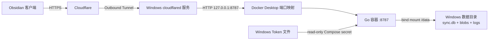

# Docker 部署设计与运维说明

## 架构



容器内必须监听 `0.0.0.0:8787`，否则 Docker NAT 无法访问；这不等于宿主机公开监听。`compose.yml` 使用长格式端口配置，把 `host_ip` 固定为 `127.0.0.1`。服务本身还要求显式 `--allow-non-loopback`，避免在非容器场景误用。

## 镜像安全属性

- 多阶段构建，最终镜像不包含 Go 工具链；
- 最终基础镜像为 distroless static，没有 shell 和包管理器；
- UID/GID 65532 非 root 运行；
- 根文件系统只读；
- `/data` 是唯一持久化写目录，`/tmp` 是受限 tmpfs；
- 删除全部 Linux capabilities；
- 启用 `no-new-privileges`；
- Token 使用只读 Compose secret，而不是环境变量；
- Docker healthcheck 调用服务端内置的 `healthcheck` 子命令；
- `SIGTERM` 会触发 Go HTTP 和 SQLite 的优雅关闭。

## 宿主机持久化

Compose 使用 bind mount：

```yaml
volumes:
  - type: bind
    source: ${OBSIDIAN_SYNC_DATA_DIR}
    target: /data
```

因此删除容器、重新构建镜像或运行 `docker compose down` 都不会删除 SQLite。数据生命周期由 Windows 路径控制，而不是由容器 ID 控制。

目录中可能出现：

```text
sync.db
sync.db-wal
sync.db-shm
server.jsonl
blobs/
```

服务运行时不要直接复制单独的 `sync.db`。使用 `scripts/docker-backup.ps1` 先优雅停止容器，让 WAL checkpoint 和数据库句柄关闭，再复制完整 `/data`。0.3 起 Chunk 内容位于 `blobs/`，数据库与该目录必须来自同一次一致备份。

## 端口边界

容器内部：

```text
0.0.0.0:8787
```

Windows 宿主机：

```text
127.0.0.1:${OBSIDIAN_SYNC_PORT}
```

验证命令：

```powershell
docker compose port sync-server 8787
Get-NetTCPConnection -LocalPort 8787 -State Listen
```

不要把 Compose 的 `host_ip` 改为 `0.0.0.0`。Cloudflare Tunnel 在同一 Windows 主机上，可以直接访问回环端口。

## 配置和密钥

`.env` 只保存版本、端口、上传限制和宿主机路径，不保存 API Token。Token 单独保存在 `OBSIDIAN_SYNC_TOKEN_FILE` 指向的文件中，并由 Compose 只读挂载为：

```text
/run/secrets/sync_api_token
```

`.env`、`runtime-data` 和 `secrets` 均已加入 `.gitignore`。`docker compose config` 会显示宿主机路径，但不会显示 Token 内容。

## 生命周期

初始化：

```powershell
.\scripts\docker-init.ps1
```

构建和启动：

```powershell
.\scripts\docker-up.ps1
```

查看状态和日志：

```powershell
docker compose ps
.\scripts\docker-logs.ps1 -Follow
```

重启：

```powershell
docker compose restart sync-server
```

停止并移除容器：

```powershell
.\scripts\docker-down.ps1
```

一致性备份：

```powershell
.\scripts\docker-backup.ps1 -DestinationDirectory 'E:\Backups\ObsidianSync'
```

每份备份包含 `data/` 和 `backup.json`。脚本会复验数据库 SHA-256，但备份仍包含明文 Vault 内容，应复制到另一台设备上的加密存储。

## 升级与回滚原则

升级前先备份，再重新构建：

```powershell
.\scripts\docker-backup.ps1 -DestinationDirectory 'E:\Backups\ObsidianSync'
.\scripts\docker-up.ps1
```

镜像与 bind-mounted 数据分离，但镜像回滚不等于数据回滚。0.3 数据库升级到 schema 4，0.2 服务会拒绝打开更高版本数据库；回到 0.2 时必须停止容器，将升级前备份的整个 `data/` 恢复到一个新目录，再让 Compose 指向该目录。不要把旧 `sync.db` 与新 `blobs/` 混用。

## Cloudflare 连接

本方案不把 `cloudflared` 放入同一个 Compose 项目，原因是：

- 用户明确需要把 Go 服务端口映射到 Windows；
- Windows 服务能在 Docker Desktop尚未完全启动时独立重试；
- Tunnel Token 生命周期不与应用容器重建绑定；
- Origin 始终清晰地指向 `http://127.0.0.1:${OBSIDIAN_SYNC_PORT}`。

Cloudflare Dashboard 中的 Published Application Route 必须与 `.env` 中端口一致。API 自己的 Bearer Token 仍然必需；建议再叠加 Cloudflare Access Service Token。

## 故障排查

容器不健康：

```powershell
docker compose ps
docker inspect obsidian-sync-server --format '{{json .State.Health}}'
.\scripts\docker-logs.ps1 -Tail 200
```

挂载失败：

- 确认 `.env` 中路径存在；
- 确认 Docker Desktop 有权访问对应 Windows 磁盘；
- 不要手工删除正在使用的 `sync.db-wal` 或 `sync.db-shm`；
- 用 `docker compose config` 查看解析后的绝对路径。

Cloudflare 返回 502：

- 先确认 `Invoke-RestMethod http://127.0.0.1:8787/healthz`；
- 再确认 Cloudflare Origin 端口与 `.env` 一致；
- 检查 `Get-Service cloudflared`；
- 检查 `cloudflared` 日志和 Tunnel Dashboard 的 connector 状态。
